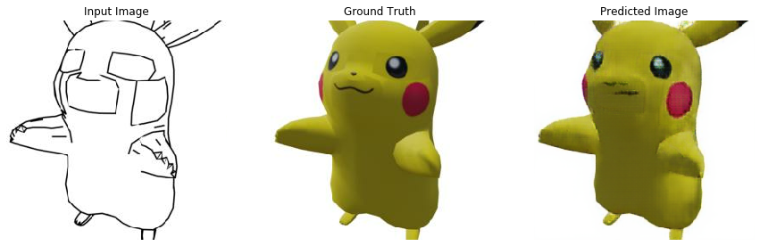

# pix2pokemon
A pix2pix model for converting edge drawing of pokemons into 3d shaded images built for College Major Project.

#### About the dataset
Dataset was created by using pokemon models from nintendo games, currently only two pokemons are present in the dataset (to limit the training time) but it can be expanded to any number of pokemons.

## How to run

#### Requirements
- Tensorflow (GPU version recommended)
- Jupyter-notebook/Jupyterlab
- A decent GPU for training
- Cudnn
- Python

Clone the repository. Open [pix2pkmn.ipynb](/pix2pokemon.ipynb), Change the PATH variable to your pkmn folder and the logdir variable if you want to use tensrboard.
Then start training.

### How to export

You can Export the trained model for using it in realtime by following instructions [here](https://github.com/affinelayer/pix2pix-tensorflow/blob/master/server)

### Results

Following are resluts after 200 epoch :

